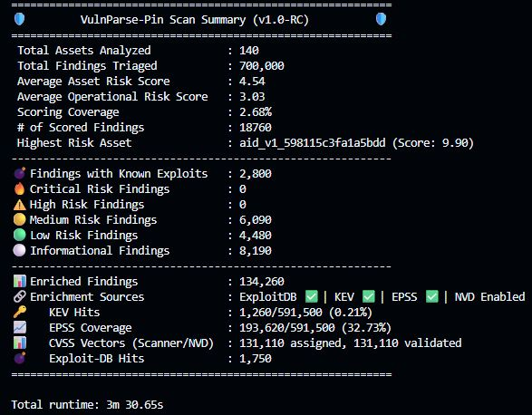

<p align="center">
  
</p>

<h1 align="center">VulnParse‑Pin</h1>

<p align="center">
Vulnerability Intelligence & Decision Support Engine
</p>

<p align="center">
Normalize • Enrich • Prioritize • Decide
</p>

<p align="center">
<a href="/documentation/docs/index.md">Index</a> •
<a href="/documentation/docs/Overview.md">Overview</a> •
<a href="/documentation/docs/Features.md">Features</a> •
<a href="/documentation/docs/Architecture.md">Architecture</a> •
<a href="/documentation/docs/Getting%20Started%20In%205%20Minutes.md">Getting Started</a> •
<a href="/documentation/docs/Licensing.md">Licensing</a>
</p>


---

VulnParse-Pin turns vulnerability scanner outputs into actionable, prioritized insights with rich context from KEV, EPSS, ExploitDB, and NVD. It helps security teams focus on what matters most by applying configurable scoring policies that emphasize real-world risk.

Input: `Thousands of findings from Nessus/OpenVAS reports with CVSS only scoring.`

Output: `A focused, ranked list of vulnerabilities enriched with exploit context and explainable scoring artifacts, ready for triage and remediation.`

**Stop sorting by severity alone. Start prioritizing by real-world risk.**

> **In a sample dataset of 1,250 findings, VulnParse-Pin reduced triage scope to 72 high-priority items while surfacing all KEV-listed vulnerabilities at the top.**
>
> **This resulted in a <mark>~94% reduction</mark> in triage volume without losing known-exploited risk signals.**

## Try It In 60 Seconds

```bash
pip install vulnparse-pin
vpp --demo
```

> Results are saved automatically to user's local app data and path shown in the terminal.


### What Happens?

VulnParse-Pin analyzed your report and prioritized vulnerabilities based on:
- **KEV** known-exploited status
- **EPSS** exploitation probability
- **ExploitDB** presence and recency
- **CVSS** metrics 
- Most recent **NVD** context
- **Asset context** (internal vs. external, public_ip vs private_ip, etc.)

### What This Means For You:

#### Instead of 12,000 findings with:

- CVSS-only scoring
- No exploit context
- No clear prioritization

#### You Now Have:

- **Ranked** enriched findings with exploit context and scoring metadata
- **Auditable**, prioritized outputs for technical and executive review
- **JSON, CSV, and Markdown reporting options** for downstream workflows and presentations

This is your vulnerability data, but now it's actionable and focused on what matters most. You can review the top-ranked vulnerabilities with confidence, knowing that the prioritization is based on real-world risk signals and enriched context.

***You now have a clear starting point for remediation.***



Example JSON Output:

```JSON
{
  "assets": [
              {
                  "asset_id": "aid_v1_413d17ffd0d4b5ea",
                  "rank": 1,
                  "score_basis": "raw",
                  "score": 59.349,
                  "top_scores": [
                      22.944,
                      21.639,
                      20.985,
                      18.691,
                      16.895
                  ],
                  "scored_findings": 500,
                  "inference": {
                      "exposure_score": 2,
                      "confidence": "low",
                      "externally_facing_inferred": false,
                      "public_service_ports_inferred": true,
                      "evidence": [
                          "Common public-service port observed (+2)",
                          "RFC1918/private IP observed (-4)",
                          "Remote administration port observed (+2)",
                          "Web service port observed (+2)"
                      ]
                  }
              },
          ...
}
```

See the [Getting Started In 5 Minutes](documentation/docs/Getting%20Started%20In%205%20Minutes.md) or [Installation](documentation/docs/Installation.md) guide for more details and options.

## Why Use VulnParse-Pin?

### VulnParse-Pin is the missing layer between vulnerability scanners and actionable remediation. 

Scanners:

- Find vulnerabilities and assign CVSS scores based on technical characteristics.
- Do not account for real-world exploitability, asset context, or organizational risk tolerance.

VulnParse-Pin:

- Turns scanner exports into an exploit-focused remediation queue you can act on immediately with inferred asset context. ***(Internal Asset with exploit ranks lower than External Asset with exploit, even if CVSS is higher for the internal asset finding.)*** [Context-aware prioritization](https://redjack.com/resources/asset-inventory-vulnerability-prioritization#:~:text=Understanding%20these%20dependencies%20allows%20you,the%20risk%20of%20significant%20disruptions.&text=An%20asset%20inventory%20provides%20the,based%20approach%20to%20vulnerability%20prioritization.&text=Asset%20inventories%20help%20you%20identify,may%20follow%20a%20phased%20approach.) is critical for effective vulnerability management.

- Prioritizes known-exploited risk first (KEV plus public exploit signals) to reduce triage noise **(user-configurable)**. [Threat Intelligence-driven prioritization](https://www.cisa.gov/known-exploited-vulnerabilities) is the most effective way to focus on what matters.

- Produces explainable scoring artifacts so analysts can **defend** remediation decisions.

- Works with existing scanner workflows (currently Nessus and OpenVAS), no platform lock-in.

- Secure-by-design:
  - No shell execution or unsafe deserialization
  - Strict input validation and sanitization
  - Least privilege principles in code and dependencies
  - Strict path enforcement for I/O operations
  - Offline mode and local feed management for sensitive environments
  - Safe parsing and enrichment with error handling and fallback mechanisms
  - No evaluation of untrusted code or data

- Configure scoring and prioritization policies to fit your organization's risk tolerance and priorities.

### Before vs. After Prioritization

| Raw scanner workflow | VulnParse-Pin workflow |
| --- | --- |
| 12,000 findings | Top 10-50 prioritized vulnerabilities (configurable) |
| Severity-only sorting inflates urgent queues | Ranked by real-world exploit risk |
| Spend hours justifying triage order | Explainable scoring artifacts support transparent decisions |
| Fragmented outputs across tools | Consistent JSON, CSV, and Markdown outputs for technical and executive audiences |

## Where It Fits

1. Run vulnerability scans as usual with your existing tools (Nessus/OpenVAS supported currently, more coming).
2. **Export** results in supported formats.
3. Use VulnParse-Pin to ***ingest, enrich, and prioritize*** findings based on real-world risk signals and configurable policies.
4. **Review** the prioritized outputs for triage and remediation planning.
5. ***Patch, mitigate, or accept*** risk based on the enriched context and explainable scoring artifacts provided by VulnParse-Pin.

`You decide what to prioritize, but VulnParse-Pin helps you make informed decisions and defend them with data.`

## Who Is VulnParse-Pin For?

VulnParse-Pin is for teams that need to triage high volumes of vulnerability findings without losing focus on what is most actionable.

- **CI/CD Workflows**: DevSecOps teams integrating vulnerability management into CI/CD pipelines for faster feedback and remediation.
- **Practitioners**: Security analysts, security engineers, SOC teams, red teams, and penetration testers.
- **Program and risk owners**: Vulnerability program managers, risk assessors, and security leadership.
- **Service providers and builders**: Consultants, MSSPs, researchers, and developers integrating or extending workflows.

See the [Overview](documentation/docs/Overview.md) documentation for more details on use cases and target audiences.

## Key Features

- **Scanner-Agnostic Normalization**: Ingests and standardizes output from any vulnerability scanner or feed (Currently Nessus/OpenVAS).

- **Powerful Optimizations**: Designed for both small and high-volume workloads with dynamic execution strategies, caching, and parallel processing:
  - Sublinear scaling with finding count
  - Parallelized scoring and prioritization paths
  - Optimized NVD enrichment with streaming and filtering
  - Tested on datasets up to 700k findings with real-world CVE distributions (~1800 findings/sec in under 5 minutes).

- **Multi-Source Enrichment**: Integrates with CISA KEV, ExploitDB, NVD, and more for comprehensive context.

- **Configurable Scoring and Prioritization Engine**: Flexible, policy-driven scoring that can be tuned to organizational risk tolerance and priorities. This includes the ability to prioritize known-exploited vulnerabilities and adjust scoring based on asset context.

- **Pass Phase Pipelines**: Modular processing stages for enrichment, scoring, and prioritization that can be customized or extended.

- **Executive and Technical Reporting**: Provides both high-level summaries for executives and detailed insights for technical teams, with explainable scoring and prioritization artifacts.

- **Offline Mode and Local Feeds**: Supports offline operation and local feed management for environments with limited connectivity or strict data handling requirements.

See the [Features](documentation/docs/Features.md) documentation for a comprehensive list of features and capabilities.

## Installation

VulnParse-Pin can be installed using pip:

```bash
pip install vulnparse-pin
```

or

install from source:

```bash
git clone https://github.com/QT-Ashley/VulnParse-Pin.git
cd VulnParse-Pin
pip install -e .
```

Standalone executables with release artifacts are also available on PyPI and GitHub Releases, which include pre-built wheels for easy installation:

```bash
pip install vulnparse_pin-1.0.0-py3-none-any.whl
```

### Run Your Own Scan

After installation, you can run VulnParse-Pin with your own scanner exports:

```bash
vpp -f path/to/your_scan.[nessus|xml] -o <output_file>.json -pp -oC <output_file>.csv -oM <output_file>.md -oMT <output_file>_technical.md 
```

Check out [Releases](https://github.com/QT-Ashley/VulnParse-Pin/releases) for the latest release artifacts.

A list of all available command-line options can be found in the [Getting Started In 5 Minutes](documentation/docs/Getting%20Started%20In%205%20Minutes.md) guide.

## Feedback and Contributions

### Tried it out? Found a bug? Have a feature request or want to contribute?

If you tried VulnParse-Pin, even briefly, please consider leaving feedback or contributing to the project:

- Did it fit your workflow?
- What was confusing or difficult to use?
- What features would you like to see next?
- What other use cases do you have in mind?

Anything you can share is helpful, whether it's a quick comment, a detailed issue, or a pull request with improvements.

## Roadmap and Future Enhancements

- **Additional Scanner Support**: Expanding normalization capabilities to support more vulnerability scanners and feeds.
- **Advanced Enrichment Sources**: Integrating additional threat intelligence sources for richer context.
- **Machine Learning Integration**: Exploring the use of machine learning models for enhanced scoring, prioritization, and AI-augmented reporting at the derived context layer (truth layer remains immutable).
- **Historical Trend Analysis**: Adding features to analyze historical vulnerability data and trends over time.
- **Community Contributions**: Encouraging and incorporating contributions from the open source community to enhance features and expand use cases.

For the latest updates on the roadmap and future enhancements, please refer to the [Roadmap](ROADMAP.md) documentation.

## Documentation

For more detailed information on how to use, configure, and extend VulnParse-Pin, please refer to the documentation:

- [Docs Index](documentation/docs/index.md)
- [Overview](documentation/docs/Overview.md)
- [Getting Started In 5 Minutes](documentation/docs/Getting%20Started%20In%205%20Minutes.md)
- [Architecture](documentation/docs/Architecture.md)
- [Pipeline System](documentation/docs/Pipeline%20System.md)
- [Security Features](documentation/docs/Security%20Features.md)
- [Current Scoring Profile (March 2026)](documentation/docs/Configs.md)
- [Configs](documentation/docs/Configs.md)
- [Benchmarks](documentation/docs/Benchmarks.md)
- [Performance Optimizations](documentation/docs/Performance%20Optimizations.md)
- [Licensing](documentation/docs/Licensing.md)
- [Value Proposition One Pager](documentation/docs/Value_Proposition_One_Pager.md)
- [VulnParse-Pin Wiki Docs](https://qt-ashley.github.io/VulnParse-Pin/)

Check out the [CHANGELOG](CHANGELOG.md) for a detailed history of changes and updates.

## License

VulnParse-Pin is licensed under the **GNU Affero General Public License v3.0 or later (AGPLv3+)**.

This ensures that improvements to VulnParse-Pin — including those used in hosted or network-accessible services — remain open and benefit the community.

### What this means in practice

- ✅ Free to use, modify, and run internally
- ✅ Free for research, education, SOC pipelines, and consulting
- ✅ Free to sell services **using** VulnParse-Pin
- ⚠️ If you run a modified version as a hosted service, you must make the source available

Unmodified use does **not** require source disclosure.

Modified use **does** require source disclosure if the modified version is used in a hosted or network-accessible service.

## Disclaimers

VulnParse-Pin is provided "as is" without any warranties or guarantees. The developers and contributors are ***not*** liable for any damages or losses resulting from the use of VulnParse-Pin. Users are responsible for ensuring that their use of VulnParse-Pin complies with all applicable laws and regulations.

VulnParse-Pin is a tool designed to assist in vulnerability management and prioritization. It should be used as part of a comprehensive security program and not as a standalone solution. Always validate and verify findings through additional analysis and testing before taking remediation actions.

VulnParse-Pin does ***not*** guarantee the accuracy or completeness of the vulnerability data it processes. Users should exercise caution and use their judgment when interpreting results and making decisions based on VulnParse-Pin's outputs.

VulnParse-Pin is ***not*** responsible for any misuse or abuse of the tool. It is intended for ethical use by security professionals and organizations to improve their security posture.

For a full list of disclaimers and legal information, please refer to the [Licensing](documentation/docs/Licensing.md) documentation.
