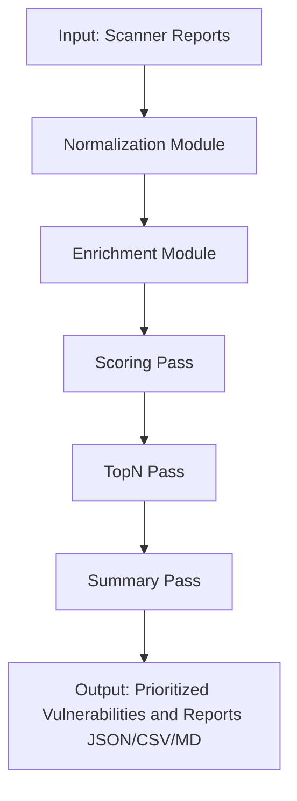

<p align="center">
  
</p>

<h1 align="center">VulnParse‑Pin</h1>

<p align="center">
Vulnerability Intelligence & Decision Support Engine
</p>

<p align="center">
Normalize • Enrich • Prioritize • Decide
</p>

<p align="center">
<a href="/docs/README.md">Index</a> •
<a href="/docs/Overview.md">Overview</a> •
<a href="/docs/Features.md">Features</a> •
<a href="/docs/Architecture.md">Architecture</a> •
<a href="/docs/Getting%20Started%20In%205%20Minutes.md">Getting Started</a> •
<a href="/docs/Licensing.md">Licensing</a>
</p>


---

# Introduction

VulnParse-Pin converts noisy scanner output into a prioritized, context-rich vulnerability pipeline focused on real-world risk.

By enriching findings with authoritative enrichment sources, and applying a configurable scoring model that emphasizes known-exploited vulnerabilities, VulnParse-Pin helps security teams cut through the noise and focus on what matters most.

## Why Use VulnParse-Pin?

- Turns large scanner exports into an exploit-focused remediation queue you can act on immediately.

- Prioritizes known-exploited risk first (KEV plus public exploit signals) to reduce triage noise (`user-configurable`).

- Produces explainable scoring artifacts so analysts can defend remediation decisions.

- Works with existing scanner workflows (currently Nessus and OpenVAS), no platform lock-in.

## Before vs After Prioritization

| Raw scanner workflow | VulnParse-Pin workflow |
| --- | --- |
| Thousands of findings with limited exploit context | Unified findings enriched with KEV, EPSS, ExploitDB, and NVD context |
| Severity-only sorting inflates urgent queues | Exploit-first scoring emphasizes likely real-world risk |
| Analysts spend cycles justifying triage order | Explainable scoring artifacts support transparent decisions |
| Fragmented outputs across tools | Consistent JSON, CSV, and Markdown outputs for technical and executive audiences |

## Try It In 60 Seconds

```bash
pip install vulnparse-pin
vpp -f [scan_file] -kev -epss -o prioritized_findings.json
```

What you get:

- Enriched findings with exploit context and scoring metadata
- Prioritized outputs for technical and executive review
- JSON, CSV, and Markdown reporting options


See the [Getting Started In 5 Minutes](docs/Getting%20Started%20In%205%20Minutes.md) guide for more details and options.


## Why VulnParse-Pin Exists

VulnParse-Pin was created to address the challenges of managing and prioritizing vulnerabilities in complex environments. The problem of vulnerability overload is well-known: organizations are inundated with thousands of findings from various scanners and feeds, making it difficult to identify which vulnerabilities pose the greatest risk and require immediate attention.

In comes VulnParse-Pin, designed to be a flexible, extensible, and open source solution that can adapt to the unique needs of different organizations. By normalizing and enriching vulnerability data, applying customizable scoring, and providing clear prioritization with explainable artifacts, VulnParse-Pin helps security teams focus their efforts on the most critical issues, ultimately improving their overall security posture.

Research from FIRST EPSS and CISA KEV consistently shows that a **small** percentage of vulnerabilities are responsible for the majority of real-world exploitation. VulnParse-Pin's scoring and prioritization engine by default, is built around this insight, ensuring that known-exploited vulnerabilities are given the attention they deserve while ***reducing*** noise from less critical findings.

See [Why VulnParse-Pin Exists](docs/Why%20VulnParse-Pin%20Exists.md) for a deeper dive into the motivation and design principles behind VulnParse-Pin.

## Philosophy and Principles

- **Scanner-Agnostic**: VulnParse-Pin is designed to work with any vulnerability scanner or feed, allowing organizations to leverage their existing tools without being locked into a specific ecosystem.

- **Context-Driven Prioritization**: Prioritization is based on a comprehensive understanding of the vulnerability landscape, including exploitability, impact, and organizational relevance. This is determined by user-configurable policies that can be tuned to align with the organization's risk tolerance and priorities.

- **Explainability**: VulnParse-Pin generates explainable artifacts that detail the factors contributing to each vulnerability's score and priority, enabling analysts to understand and trust the results.

- **Open Source**: VulnParse-Pin is fully open source under the AGPLv3+ license, fostering transparency and community collaboration.

- **SSDLC Development**: VulnParse-Pin is developed with security best practices in mind and focuses on Secure-By-Design principles first and foremost.

- **Extensibility**: The architecture is designed to be modular and extensible, allowing for easy integration with existing tools and workflows, as well as customization to meet specific organizational needs.

- **Centralized Run-Context**: All processing stages have access to a shared context that allows for dynamic decision-making and cross-pass communication, enabling more sophisticated prioritization logic.

- **Stable Contracts and APIs**: VulnParse-Pin maintains stable input/output contracts and APIs to ensure that integrations and customizations remain functional across updates, fostering long-term adoption and community contributions.

- **Comprehensive Documentation**: Clear and detailed documentation is provided to help users understand how to use, configure, and extend VulnParse-Pin effectively, as well as to encourage community contributions and collaboration.

## Who Is VulnParse-Pin For?

VulnParse-Pin is for teams that need to triage high volumes of vulnerability findings without losing focus on what is most actionable.

- **Practitioners**: Security analysts, security engineers, SOC teams, red teams, and penetration testers.
- **Program and risk owners**: Vulnerability program managers, risk assessors, and security leadership.
- **Service providers and builders**: Consultants, MSSPs, researchers, and developers integrating or extending workflows.

See the [Overview](docs/Overview.md) documentation for more details on use cases and target audiences.

## Key Features

- **Scanner-Agnostic Normalization**: Ingests and standardizes output from any vulnerability scanner or feed (Currently Nessus/OpenVAS).

- **Multi-Source Enrichment**: Integrates with CISA KEV, ExploitDB, NVD, and more for comprehensive context.

- **Configurable Scoring Engine**: Flexible, policy-driven scoring that can be tuned to organizational risk tolerance and priorities.

- **Pass Phase Pipelines**: Modular processing stages for enrichment, scoring, and prioritization that can be customized or extended.

- **Robust Security Posture**: Developed with SSDLC principles and security best practices, including regular audits, robust logging, I/O file handling, feed tamper detection, and an included SBOM for supply chain transparency.

- **Executive and Technical Reporting**: Provides both high-level summaries for executives and detailed insights for technical teams, with explainable scoring and prioritization artifacts.

- **Streaming Processing**: Capable of handling large volumes of vulnerability data efficiently through streaming and batch processing modes.

- **Offline Mode and Local Feeds**: Supports offline operation and local feed management for environments with limited connectivity or strict data handling requirements.

See the [Features](docs/Features.md) documentation for a comprehensive list of features and capabilities.

## VulnParse-Pin Architecture

VulnParse-Pin is built on a modular architecture that allows for flexibility and extensibility.



See the [Architecture](docs/Architecture.md) documentation for a deeper dive into the design and processing flow of VulnParse-Pin.

## How It Works

1. **Report Ingestion**: VulnParse-Pin accepts vulnerability reports in various formats (currently Nessus/OpenVAS) and normalizes them into a consistent internal structure.

2. **Threat-Intelligence Enrichment**: VulnParse-Pin uses authoritative sources like CISA KEV, ExploitDB, FIRST EPSS, and NVD to enrich vulnerability data with critical context such as known exploits, real-world exploitation trends, and detailed CVSS metrics.

3. **Config-Driven Scoring and Prioritization**: The engine applies a configurable scoring model and prioritization logic that can be tuned to prioritize what matters most to the organization. By default, it emphasizes known-exploited vulnerabilities while reducing noise from less critical findings.

4. **Explainable Artifacts**: For each vulnerability, VulnParse-Pin generates explainable artifacts that detail the factors contributing to its score and priority, enabling analysts to understand and trust the results.

5. **Pass Phase Processing**: The processing pipeline is organized into distinct passes (Scoring, TopN, Summary) that can be customized or extended as needed.

6. **Output Generation**: The final output includes a prioritized list of vulnerabilities along with detailed reports in JSON, CSV, and Markdown formats for both technical and executive audiences.

See the [Architecture](docs/Architecture.md) and [Pipeline System](docs/Pipeline%20System.md) documentation for a deeper dive into the design and processing flow of VulnParse-Pin.

## Installation

VulnParse-Pin can be installed using pip:

```bash
pip install vulnparse-pin
```

or

install from source:

```bash
git clone https://github.com/VulnParse-Pin/VulnParse-Pin.git
cd VulnParse-Pin
pip install -r requirements.txt
```

A list of all available command-line options can be found in the [Getting Started In 5 Minutes](docs/Getting%20Started%20In%205%20Minutes.md) guide.

## Performance

VulnParse-Pin is designed to handle large volumes of vulnerability data efficiently. Performance benchmarks indicate that VulnParse-Pin can process thousands of vulnerabilities per minute, depending on the complexity of the enrichment and scoring policies applied. The architecture supports both streaming and batch processing modes, allowing it to scale effectively in different environments.  

Latest benchmarks and performance metrics can be found in the [Benchmarks](docs/Benchmarks.md) documentation.

## Roadmap and Future Enhancements

- **Additional Scanner Support**: Expanding normalization capabilities to support more vulnerability scanners and feeds.
- **Advanced Enrichment Sources**: Integrating additional threat intelligence sources for richer context.
- **Machine Learning Integration**: Exploring the use of machine learning models for enhanced scoring, prioritization, and AI-augmented reporting at the derived context layer (truth layer remains immutable).
- **Historical Trend Analysis**: Adding features to analyze historical vulnerability data and trends over time.
- **Community Contributions**: Encouraging and incorporating contributions from the open source community to enhance features and expand use cases.

For the latest updates on the roadmap and future enhancements, please refer to the [Roadmap](docs/Roadmap.md) documentation.

## Documentation

For more detailed information on how to use, configure, and extend VulnParse-Pin, please refer to the documentation:

- [Docs Index](docs/README.md)
- [Overview](docs/Overview.md)
- [Getting Started In 5 Minutes](docs/Getting%20Started%20In%205%20Minutes.md)
- [Architecture](docs/Architecture.md)
- [Pipeline System](docs/Pipeline%20System.md)
- [Security](docs/Security.md)
- [Current Scoring Profile (March 2026)](docs/Config.md)
- [Configs](docs/Configs.md)
- [Benchmarks](docs/Benchmarks.md)
- [Licensing](docs/Licensing.md)

## License

VulnParse-Pin is licensed under the **GNU Affero General Public License v3.0 or later (AGPLv3+)**.

This ensures that improvements to VulnParse-Pin — including those used in hosted or network-accessible services — remain open and benefit the community.

### What this means in practice

- ✅ Free to use, modify, and run internally
- ✅ Free for research, education, SOC pipelines, and consulting
- ✅ Free to sell services **using** VulnParse-Pin
- ⚠️ If you run a modified version as a hosted service, you must make the source available

Unmodified use does **not** require source disclosure.

### Commercial licensing

Commercial licensing or AGPL exceptions may be available for organizations that wish to embed VulnParse-Pin into proprietary products or managed services.

## Disclaimers

VulnParse-Pin is provided "as is" without any warranties or guarantees. The developers and contributors are ***not*** liable for any damages or losses resulting from the use of VulnParse-Pin. Users are responsible for ensuring that their use of VulnParse-Pin complies with all applicable laws and regulations.

VulnParse-Pin is a tool designed to assist in vulnerability management and prioritization. It should be used as part of a comprehensive security program and not as a standalone solution. Always validate and verify findings through additional analysis and testing before taking remediation actions.

VulnParse-Pin does ***not*** guarantee the accuracy or completeness of the vulnerability data it processes. Users should exercise caution and use their judgment when interpreting results and making decisions based on VulnParse-Pin's outputs.

VulnParse-Pin is ***not*** responsible for any misuse or abuse of the tool. It is intended for ethical use by security professionals and organizations to improve their security posture.

For a full list of disclaimers and legal information, please refer to the [Licensing](docs/Licensing.md) documentation.
