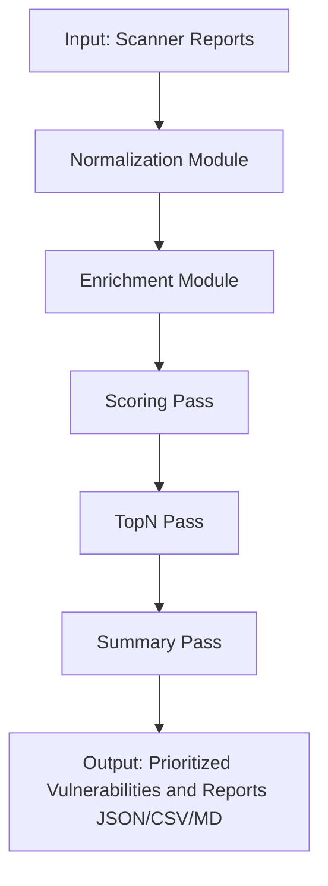

# VulnParse-Pin Overview

VulnParse-Pin is a vulnerability intelligence and decision support engine for teams that need consistent, explainable risk prioritization from scanner output.

It ingests vulnerability reports (currently Nessus XML and OpenVAS XML), normalizes findings into a common model, enriches them with threat intelligence, computes risk scores, and ranks what to fix first.

## What it is

- A CLI-first vulnerability parsing and prioritization platform
- A deterministic pipeline: parse → enrich → score → rank → export
- A transparent scoring system with configurable weighting and risk bands
- A high-volume capable engine optimized for large finding sets

## What problem it solves

Security teams often face:

- Inconsistent scanner formats and schemas
- Manual triage bottlenecks and alert fatigue
- Fragmented enrichment from KEV, EPSS, NVD, and exploit sources
- Opaque risk calculations that are hard to audit or explain

VulnParse-Pin addresses this by standardizing data, centralizing enrichment, and producing reproducible risk outputs with clear provenance.

## Philosophy and Principles

- **Context-Driven Prioritization**: Prioritization is based on a comprehensive understanding of the vulnerability landscape, including exploitability, impact, and organizational relevance. This is determined by user-configurable policies that can be tuned to align with the organization's risk tolerance and priorities.

- **Explainability**: VulnParse-Pin generates explainable artifacts that detail the factors contributing to each vulnerability's score and priority, enabling analysts to understand and trust the results.

- **Open Source**: VulnParse-Pin is fully open source under the AGPLv3+ license, fostering transparency and community collaboration.

- **SSDLC Development**: VulnParse-Pin is developed with security best practices in mind and focuses on Secure-By-Design principles first and foremost.

- **Extensibility**: The architecture is designed to be modular and extensible, allowing for easy integration with existing tools and workflows, as well as customization to meet specific organizational needs.

- **Centralized Run-Context**: All processing stages have access to a shared context that allows for dynamic decision-making and cross-pass communication, enabling more sophisticated prioritization logic.

- **Stable Contracts and APIs**: VulnParse-Pin maintains stable input/output contracts and APIs to ensure that integrations and customizations remain functional across updates, fostering long-term adoption and community contributions.

- **Comprehensive Documentation**: Clear and detailed documentation is provided to help users understand how to use, configure, and extend VulnParse-Pin effectively, as well as to encourage community contributions and collaboration.

## Who it is for

- SOC analysts and vulnerability management teams
- Pentest and advisory organizations delivering client triage
- Security engineering teams building CI/CD security workflows
- Researchers and contributors needing auditable risk logic

## Core capabilities

- Schema detection and parser selection for supported scanner formats
- Enrichment from KEV, EPSS, NVD, and Exploit-DB (online/offline modes)
- Derived pass system for scoring and Top-N triage
- JSON and CSV export paths with secure defaults
- Presentation overlays for reporting consumers

## Why organizations use it

- **Faster triage:** converts raw findings into ranked remediation queues
- **Better governance:** explainable, configurable scoring policy
- **Operational fit:** scalable behavior from small scans to high-volume workloads
- **Security posture:** hardened I/O and sanitization controls in default flows

## Getting started

Read [Getting Started In 5 Minutes](Getting%20Started%20In%205%20Minutes.md) for a working first run.

Then continue with:

- [Architecture](Architecture.md)
- [Detection and Parsing](Detection%20and%20Parsing.md)
- [Pipeline System](Pipeline%20System.md)
- [Configs](Configs.md)

## Architecture

VulnParse-Pin is built on a modular architecture that allows for flexibility and extensibility.

<<<<<<< HEAD
See the [Architecture](Architecture.md) documentation for a deeper dive into the design and processing flow of VulnParse-Pin.
=======
<<<<<<< HEAD:documentation/docs/Overview.md
See the [Architecture](Architecture.md) documentation for a deeper dive into the design and processing flow of VulnParse-Pin.
=======
See the [Architecture](docs/Architecture.md) documentation for a deeper dive into the design and processing flow of VulnParse-Pin.
>>>>>>> main:docs/Overview.md
>>>>>>> main

## Performance

VulnParse-Pin is designed to handle large volumes of vulnerability data efficiently. Performance benchmarks indicate that VulnParse-Pin can process thousands of vulnerabilities per minute, depending on the complexity of the enrichment and scoring policies applied. The architecture supports both streaming and batch processing modes, allowing it to scale effectively in different environments.  

<<<<<<< HEAD
Latest benchmarks and performance metrics can be found in the [Benchmarks](Benchmarks.md) documentation.
=======
<<<<<<< HEAD:documentation/docs/Overview.md
Latest benchmarks and performance metrics can be found in the [Benchmarks](Benchmarks.md) documentation.
=======
Latest benchmarks and performance metrics can be found in the [Benchmarks](docs/Benchmarks.md) documentation.
>>>>>>> main:docs/Overview.md
>>>>>>> main

## How It Works

1. **Report Ingestion**: VulnParse-Pin accepts vulnerability reports in various formats (currently Nessus/OpenVAS) and normalizes them into a consistent internal structure.

2. **Threat-Intelligence Enrichment**: VulnParse-Pin uses authoritative sources like CISA KEV, ExploitDB, FIRST EPSS, and NVD to enrich vulnerability data with critical context such as known exploits, real-world exploitation trends, and detailed CVSS metrics.

3. **Config-Driven Scoring and Prioritization**: The engine applies a configurable scoring model and prioritization logic that can be tuned to prioritize what matters most to the organization. By default, it emphasizes known-exploited vulnerabilities while reducing noise from less critical findings.

4. **Explainable Artifacts**: For each vulnerability, VulnParse-Pin generates explainable artifacts that detail the factors contributing to its score and priority, enabling analysts to understand and trust the results.

5. **Pass Phase Processing**: The processing pipeline is organized into distinct passes (Scoring, TopN, Summary) that can be customized or extended as needed.

6. **Output Generation**: The final output includes a prioritized list of vulnerabilities along with detailed reports in JSON, CSV, and Markdown formats for both technical and executive audiences.

<<<<<<< HEAD
See the [Architecture](Architecture.md) and [Pipeline System](Pipeline%20System.md) documentation for a deeper dive into the design and processing flow of VulnParse-Pin.
=======
<<<<<<< HEAD:documentation/docs/Overview.md
See the [Architecture](Architecture.md) and [Pipeline System](Pipeline%20System.md) documentation for a deeper dive into the design and processing flow of VulnParse-Pin.
=======
See the [Architecture](docs/Architecture.md) and [Pipeline System](docs/Pipeline%20System.md) documentation for a deeper dive into the design and processing flow of VulnParse-Pin.
>>>>>>> main:docs/Overview.md
>>>>>>> main

## Licensing overview

VulnParse-Pin is available under AGPLv3+ for free/open usage.

Commercial pathways (Enterprise and MSSP) are documented in [Licensing](Licensing.md), including template sections for organizations that need proprietary embedding or managed-service terms.

## Support VulnParse-Pin

- Contribute code and tests
- Propose new passes and parser improvements
- Report reproducible bugs and edge cases
- Sponsor development for roadmap acceleration

For project intent and strategic direction, see [Mission Statement](Mission%20Statement.md) and [Why VulnParse-Pin Exists](Why%20VulnParse-Pin%20Exists.md).
