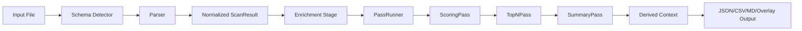
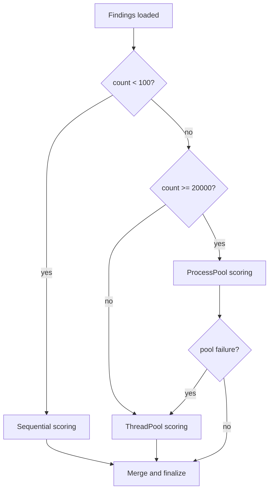

# Pipeline System

VulnParse-Pin’s pipeline is built around derived passes that run after parsing and enrichment.

## Pass contract

Pass abstractions live in `src/vulnparse_pin/core/classes/pass_classes.py`.

- `Pass` protocol defines `name`, `version`, and `run(ctx, scan)`
- `PassRunner` executes passes in sequence
- `DerivedContext` stores pass output by versioned key

Current default pass order:

1. `Scoring@2.0`
2. `TopN@1.0`
3. `Summary@1.0`

## End-to-end flow

## Runtime sequence

```mermaid
sequenceDiagram
    participant CLI as CLI
    participant Main as main.py
    participant Detector as SchemaDetector
    participant Parser as XML Parser
    participant Enrich as Enrichment Services
    participant Runner as PassRunner
    participant Score as ScoringPass
    participant TopN as TopNPass
    participant Summary as SummaryPass

    CLI->>Main: vpp <input> -o <output>
    Main->>Detector: detect(input)
    Detector-->>Main: parser spec
    Main->>Parser: parse(input)
    Parser-->>Main: ScanResult
    Main->>Enrich: apply KEV/EPSS/NVD/ExploitDB
    Enrich-->>Main: enriched ScanResult
    Main->>Runner: run_all(ctx, scan)
    Runner->>Score: run(ctx, scan)
    Score-->>Runner: DerivedPassResult(Scoring@2.0)
    Runner->>TopN: run(ctx, scan)
    TopN-->>Runner: DerivedPassResult(TopN@1.0)
    Runner->>Summary: run(ctx, scan)
    Summary-->>Runner: DerivedPassResult(Summary@1.0)
    Runner-->>Main: scan with derived context
    Main-->>CLI: output artifacts
```

## Scoring execution strategy

`ScoringPass` switches strategy based on finding count to minimize overhead at small scale and maximize throughput at large scale.

## Data flow guarantees

- Passes produce `DerivedPassResult` instead of mutating schema shape ad hoc
- Derived outputs are namespaced by pass name/version
- Core findings remain available; derived artifacts are additive
- Output layers can consume either raw or derived-enriched context

## Adding a new pass

1. Implement a class matching `Pass` protocol
2. Return stable `name` and semantic `version`
3. Emit typed output payload inside `DerivedPassResult`
4. Add to pass list in orchestrator
5. Add contract and determinism tests

## Common pass pitfalls

- Avoid non-serializable objects in process-pool worker inputs
- Use explicit tie-breakers in heaps when payloads include dicts/lists
- Keep worker functions top-level for pickle compatibility
- Preserve deterministic ordering where output is ranked

## Deep-dive references

- [Caching Deep Dive](Caching%20Deep%20Dive.md)
- [Runtime Policy Deep Dive](Runtime%20Policy%20Deep%20Dive.md)
- [Scoring and Prioritization Deep Dive](Scoring%20and%20Prioritization%20Deep%20Dive.md)
